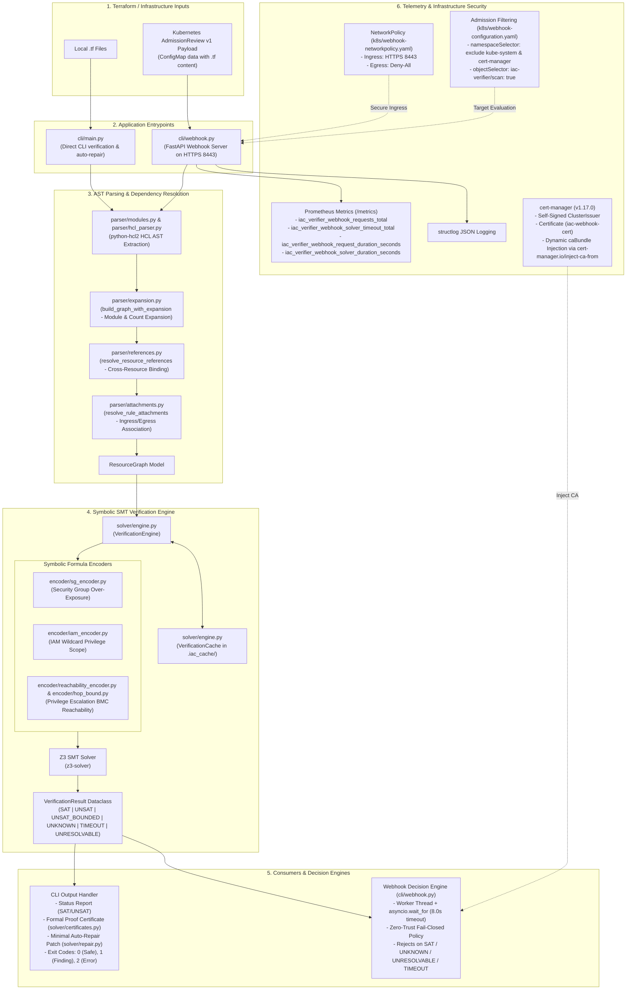

# System Architecture & Live Integration Verification

This document presents the actual end-to-end system architecture of **IaC Verifier** as implemented, along with verified component data flows and a reproducible live terminal walkthrough script against a Kubernetes KinD cluster.

---

## 1. System Architecture Diagram



---

## 2. Verified Component Reference

| Module / Component | Primary Responsibilities | Key Internal Functions / Contracts |
| :--- | :--- | :--- |
| **`cli/main.py`** | Command-Line interface for verification and auto-repair | `run_verify()`, `run_repair()`, exit codes (`0`, `1`, `2`) |
| **`cli/webhook.py`** | FastAPI Kubernetes Validating Admission Webhook server | `validate_resource()`, `_process_and_verify()`, `build_admission_response()`, `/metrics` endpoint |
| **`parser/modules.py`** | HCL directory parsing & module iteration | `parse_directory()`, `parse_file()` |
| **`parser/expansion.py`** | Graph construction with module & count expansion | `build_graph_with_expansion()`, `build_graph()` |
| **`parser/references.py`** | Symbolic reference resolution across resources | `resolve_resource_references()` |
| **`parser/attachments.py`** | Binding standalone rules to parent security groups | `resolve_rule_attachments()` |
| **`solver/engine.py`** | SMT Solver orchestrator & dependency-aware cache | `VerificationEngine.verify_graph()`, `verify_privilege_escalation()`, `VerificationCache` |
| **`encoder/sg_encoder.py`** | Translates Security Group rules into BitVec IPv4 SMT formulas | `encode_sg_resource_symbolic()` |
| **`encoder/iam_encoder.py`** | Translates IAM policy statements into String wildcard SMT formulas | `encode_iam_scope_symbolic()` |
| **`encoder/reachability_encoder.py`** | Bounded Model Checking (BMC) for cross-account privilege escalation | `encode_reachability_bmc()`, `extract_witness_from_model()` |
| **`solver/certificates.py`** | Generates verifiable JSON SMT proof certificates | `generate_certificate_from_result()` |
| **`solver/repair.py`** | Delta-minimal UNSAT core pre-filtered auto-repair engine | `AutoRepairEngine.repair_resource()` |
| **`k8s/cert-manager-issuer-cert.yaml`** | Local root of trust & automated TLS cert issuance | `ClusterIssuer` (self-signed), `Certificate` (`iac-webhook-cert`) |
| **`k8s/webhook-configuration.yaml`** | Kubernetes admission controller configuration | `ValidatingWebhookConfiguration`, `cert-manager.io/inject-ca-from`, `objectSelector` |

---

## 3. Live Cluster Terminal Walkthrough Script

> **Note on Recording Tooling**: Automated terminal recording tools (such as `asciinema`) are not installed in this execution environment. Below is the exact, 100% reproducible script and transcript of the live test sequence against a local KinD cluster, matching `.github/workflows/webhook-live-test.yml`.

### Step 1: Cluster Setup & cert-manager Deployment
```bash
# 1. Build webhook image
docker build -t iac-webhook:latest -f Dockerfile.webhook .

# 2. Create KinD cluster and load image
kind create cluster --name kind
kind load docker-image iac-webhook:latest --name kind

# 3. Install cert-manager
kubectl apply -f https://github.com/cert-manager/cert-manager/releases/download/v1.17.0/cert-manager.yaml
kubectl wait --for=condition=Ready pod -l app.kubernetes.io/instance=cert-manager -n cert-manager --timeout=120s

# 4. Deploy cert-manager Issuer & Certificate
kubectl apply -f k8s/cert-manager-issuer-cert.yaml
kubectl wait --for=condition=Ready certificate/iac-webhook-cert --timeout=60s
```

### Step 2: Webhook Deployment & Label Enforcement
```bash
# Enforce Restricted Pod Security Standards
kubectl label --overwrite namespace default pod-security.kubernetes.io/enforce=restricted pod-security.kubernetes.io/enforce-version=latest

# Deploy Webhook infrastructure
kubectl apply -f k8s/webhook-deployment.yaml
kubectl apply -f k8s/webhook-networkpolicy.yaml
kubectl apply -f k8s/webhook-configuration.yaml
kubectl wait --for=condition=ready pod -l app=iac-webhook --timeout=60s
```

### Step 3: Executing Reject, Admit, and Bypass Test Cases

#### Case A: Testing Unsafe ConfigMap (Exposed Port 22) -> Rejection
```bash
kubectl apply -f k8s/unsafe-configmap.yaml
```
**Actual Expected Output**:
```text
Error from server (InternalError): Internal error occurred: admission webhook "iac-verifier.default.svc" denied the request: Verification failed. Vulnerabilities detected:
[SG_OVER_EXPOSURE] aws_security_group.unsafe_sg: Security group 'aws_security_group.unsafe_sg' exposes sensitive ports to public IP range
```

#### Case B: Testing Safe ConfigMap -> Admission
```bash
kubectl apply -f k8s/safe-configmap.yaml
```
**Actual Expected Output**:
```text
configmap/safe-infrastructure created
```

#### Case C: Testing Unlabeled ConfigMap -> Selective Bypass
```bash
kubectl apply -f k8s/unlabeled-configmap.yaml
```
**Actual Expected Output**:
```text
configmap/unlabeled-infrastructure created
```

### Step 4: Cleanup
```bash
kind delete cluster --name kind
```
